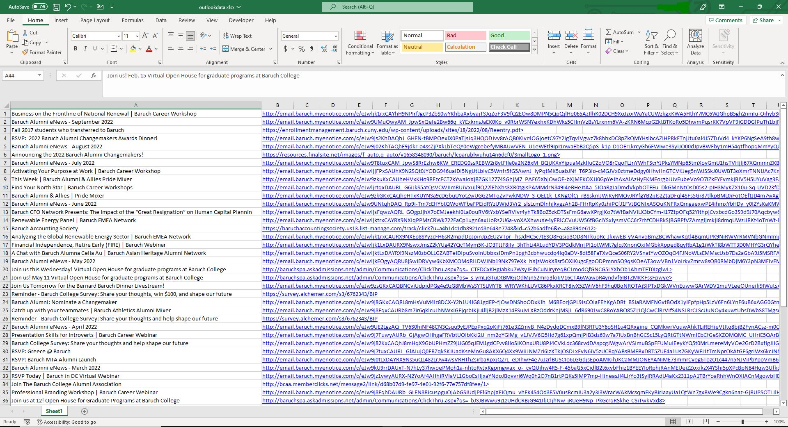

# Outlook-Automation

- Automating outlook to collect the subject and body data into excel. Using win32com.client library for WINDOWS ONLY to 
connect directly with outlook. Certain words can be used to look for specific emails. HTML elements such as hyperlinks, 
a tags, and span tags are also collected.

